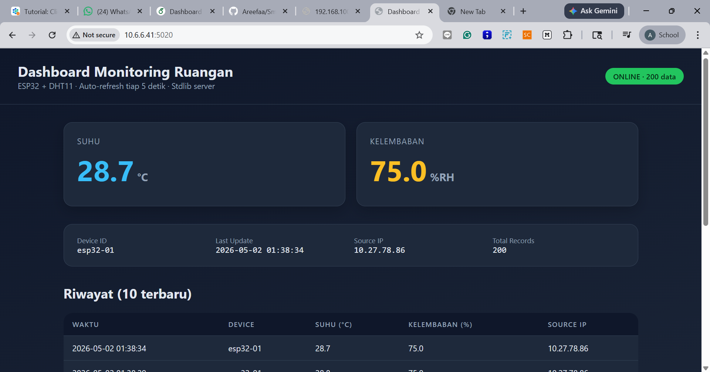

# Dashboard Monitoring Ruangan dengan ESP32 sebagai Client

> **Room Temperature and Humidity Monitoring Dashboard with ESP32 as Client**

Project Komunikasi Data & Jaringan Komputer yang mendemonstrasikan komunikasi client–server berbasis HTTP antara mikrokontroler ESP32 (sebagai client) dan Flask server di laptop/PC (sebagai server). ESP32 membaca data suhu & kelembaban dari sensor DHT11, lalu mengirimkannya ke server melalui HTTP POST dalam format JSON. Server menampilkannya pada dashboard web yang auto-refresh.

- Kelompok 5        : Vytis Rabbani Rex (23/511414/PA/21789)
                    : Aufa Akmal Bunaya (23/515767/PA/22027)
                    : Ahmad Firdaus Zen Omar Idrus (23/521171/PA/22406)
                    : Nawal Arifah Herman (23/523349/PA/22520)
                    : Ihsan Hammam (24/532900/PA/22551)

- Akun GitHub       : [`Rexyxy`](https://github.com/Rexyxy)
                    : [`aufaakmalbunaya`](https://github.com/aufaakmalbunaya)
                    : [`zenomar`](https://github.com/zenomar)
                    : [`Areefaa`](https://github.com/Areefaa)
                    : [`ihsadk`](https://github.com/ihsadk)

- Repository        : `https://github.com/Areefaa/Smart-Room-Monitoring.git`

---

## 1. Deskripsi Project
Tujuan project ini adalah mengimplementasikan pola komunikasi client–server pada lingkungan IoT sederhana:
- ESP32 (Client)    : membaca suhu & kelembaban tiap 5 detik, lalu mengirim ke server.
- Laptop/PC (Server): menerima data, menyimpan riwayat di memori, dan menampilkannya di dashboard web.
- Browser           : pengguna akhir melihat data real-time di dashboard.

Project ini bukan hanya sekadar membaca sensor, tapi menunjukkan bagaimana dua perangkat berbeda (mikrokontroler dan PC) dapat bertukar data lewat jaringan WiFi dengan protokol HTTP dan payload JSON.


## 2. Tools & Komponen
### Hardware
| Komponen              | Jumlah | Keterangan |
|-----------------------|--------|------------|
| ESP32 Dev Module      | 1      | Mikrokontroler + WiFi |
| Sensor DHT11          | 1      | Suhu & kelembaban |
| Kabel jumper          | 3–4    | Female-to-female / sesuai header |
| Breadboard            | 1      |  |
| Laptop/PC             | 1      | Menjalankan Flask server |
| Kabel USB             | 1      | ESP32 ↔ laptop (upload + serial monitor) |

### Software
- Arduino IDE
- ESP32 Board Package (via Boards Manager)
- Library DHT sensor library by Adafruit + Adafruit Unified Sensor
- Python 3.10+
- Flask ≥ 3.0
- Browser
- WiFi lokal yang sama untuk ESP32 & laptop


## 3. Arsitektur Sistem
┌───────────────┐   I²C/1-Wire   ┌─────────────┐   WiFi (HTTP POST + JSON)    ┌──────────────────┐   HTTP GET    ┌─────────────┐
│  DHT11 Sensor │ ─────────────▶ │   ESP32     │ ───────────────────────────▶ │  Flask Server    │ ◀──────────── │   Browser   │
│ (Suhu & RH)   │                │  (Client)   │                              │  (Laptop / PC)   │               │ (Dashboard) │
└───────────────┘                └─────────────┘                              └──────────────────┘               └─────────────┘
                                                                                       │
                                                                                       └── menyimpan riwayat (in-memory deque)
```

Aliran data:
1. DHT11            → ESP32 (via pin GPIO4, protokol 1-Wire).
2. ESP32            → Flask server (via WiFi, HTTP POST `/sensor-data`, body JSON).
3. Flask server     → Browser (via HTTP GET `/`, render HTML dashboard dengan data terbaru).


## 4. Wiring Diagram (ESP32 ↔ DHT11)

| DHT11 Pin | ESP32 Pin    | Kabel    |
|-----------|--------------|----------|
| VCC (+)   | 3V3          | Merah    |
| DATA (S)  | GPIO 4       | Kuning   |
| GND (−)   | GND          | Hitam    |

> Sensor DHT11 raw (4-pin) — tambahkan resistor 10 kΩ antara `VCC` dan `DATA` sebagai pull-up.

Diagram ASCII:
   ESP32                          DHT11
┌──────────┐                   ┌──────────┐
│   3V3 ───┼──────── VCC ──────┤ +        │
│  GPIO4 ──┼──────── DATA ─────┤ S (data) │
│   GND ───┼──────── GND ──────┤ -        │
└──────────┘                   └──────────┘


## 5. Struktur Folder
dashboard-monitoring-esp32/
├── README.md
├── .gitignore
├── firmware/
│   └── esp32_dht11_client/
│       └── esp32_dht11_client.ino      # Kode ESP32 (client)
├── server/
│   ├── app.py                          # Flask server
│   ├── requirements.txt
│   ├── templates/
│   │   └── dashboard.html              # Dashboard UI
│   └── static/                         # (reserved untuk asset)
├── docs/
│   ├── wiring-diagram.md
│   └── tutorial.md                     # Tutorial lengkap
└── screenshots/                        # Bukti eksekusi
    └── dashboard.png                   
```


## 6. Cara Menjalankan Project
### 6.1 Persiapan di Laptop (Server)

```bash
# 1. Clone repo
git clone https://github.com/Areefaa/Smart-Room-Monitoring.git
cd dashboard-monitoring-esp32/server

# 2. Buat virtual env 
python -m venv .venv
# Windows:
.\.venv\Scripts\activate
# Linux/macOS:
source .venv/bin/activate

# 3. Install dependencies
pip install -r requirements.txt

# 4. Jalankan server
python app.py
```

Server akan listening di `http://0.0.0.0:5020`. Catat IP LAN laptop kamu:
- Windows → `ipconfig` → cari "IPv4 Address" (contoh `192.168.1.10`).
- Linux/macOS → `ip a` / `ifconfig`.

> ⚠️ Firewall Windows mungkin akan meminta izin saat pertama kali; klik Allow.

### 6.2 Persiapan di ESP32 (Client)

1. Buka Arduino IDE → File → Preferences → Additional Boards URL:
   ```
   https://espressif.github.io/arduino-esp32/package_esp32_index.json
   ```
2. Tools → Board → Boards Manager → cari `esp32` → install.
3. Tools → Manage Libraries → cari & install:
   - `DHT sensor library` by Adafruit
   - `Adafruit Unified Sensor`
4. Buka `firmware/esp32_dht11_client/esp32_dht11_client.ino`.
5. Edit tiga baris berikut sesuai lingkunganmu:
   ```cpp
   const char* WIFI_SSID     = "NAMA_WIFI_ANDA";
   const char* WIFI_PASSWORD = "PASSWORD_WIFI_ANDA";
   const char* SERVER_URL    = "http://192.168.1.10:5020/sensor-data"; // IP laptop
   ```
6. Tools → Board → pilih ESP32 Dev Module (atau board ESP32 yang sesuai).
7. Tools → Port → pilih COM yang muncul saat ESP32 ditancapkan.
8. Klik Upload (→).
9. Buka Serial Monitor (115200 baud) untuk melihat log.

### 6.3 Verifikasi
- Di serial monitor ESP32 akan muncul:
  ```
  [DHT11] Suhu: 29.5 C | Kelembaban: 70.0 %
  [HTTP] POST http://192.168.1.10:5020/sensor-data -> {"device_id":"esp32-01","temperature":29.5,"humidity":70.0}
  [HTTP] Response code: 200
  ```
- Buka browser di laptop → `http://192.168.1.10:5020/` → dashboard tampil dengan data suhu, kelembaban, dan riwayat 10 data terakhir (auto-refresh tiap 5 detik).

---

## 7. Alur Komunikasi

1. ESP32 connect ke WiFi (WPA2) menggunakan library `WiFi.h`.
2. Tiap 5 detik, ESP32 baca DHT11 (`dht.readTemperature()`, `dht.readHumidity()`).
3. ESP32 menyusun JSON dan mengirim HTTP POST ke endpoint `/sensor-data` server.
4. Flask menerima JSON, memvalidasi, menyimpan ke `deque` (riwayat max 200 entri).
5. Browser membuka `http://<IP>:5020/` → Flask me-render `dashboard.html` dengan data terbaru.
6. Halaman auto-refresh tiap 5 detik via `<meta http-equiv="refresh" content="5">`.

---

## 8. Contoh API Request
### 8.1 Request dari ESP32 (JSON payload)
```json
POST /sensor-data HTTP/1.1
Host: 192.168.1.10:5020
Content-Type: application/json

{
  "device_id": "esp32-01",
  "temperature": 29.5,
  "humidity": 70
}
```

### 8.2 Response dari server

```json
{
  "status": "ok",
  "received": {
    "device_id": "esp32-01",
    "temperature": 29.5,
    "humidity": 70.0,
    "timestamp": "2025-05-01 10:30:15",
    "source_ip": "192.168.1.42"
  }
}
```

### 8.3 Uji manual dengan `curl` (tanpa ESP32)
```bash
curl -X POST http://192.168.1.10:5020/sensor-data \
  -H "Content-Type: application/json" \
  -d '{"device_id":"manual","temperature":28.3,"humidity":65}'
```

### 8.4 Endpoint tambahan
| Endpoint         | Method | Deskripsi                                     |
|------------------|--------|-----------------------------------------------|
| `/`              | GET    | Dashboard HTML (auto-refresh 5 s)             |
| `/sensor-data`   | POST   | Terima data sensor (dipanggil ESP32)          |
| `/api/latest`    | GET    | JSON data terbaru                             |
| `/api/history`   | GET    | JSON seluruh riwayat (max 200)                |
| `/health`        | GET    | Health check                                  |

---

## 9. Testing & Troubleshooting
| Masalah                                  | Kemungkinan Penyebab                                  | Solusi                                                                 |
|------------------------------------------|-------------------------------------------------------|------------------------------------------------------------------------|
| ESP32 tidak connect WiFi                 | SSID/password salah, WiFi 5 GHz, sinyal lemah         | Cek SSID/password, pastikan WiFi **2.4 GHz** (ESP32 tidak 5 GHz)       |
| ESP32 connect tapi POST gagal            | IP server salah / beda subnet / firewall              | `ping <IP-laptop>` dari HP; matikan firewall / Allow port 5020         |
| Server tidak menerima data               | Flask tidak running, port conflict                    | Cek terminal Flask; ganti `PORT` di `app.py` jika bentrok              |
| IP laptop berubah-ubah                   | DHCP memberi IP baru tiap hari                        | Set **IP statis** di router / di pengaturan WiFi laptop                |
| DHT11 membaca `NaN`                      | Wiring longgar, VCC kurang, pull-up hilang, pin salah | Cek GPIO (pakai GPIO4), kencangkan kabel, tambah resistor 10 kΩ        |
| Dashboard tidak bisa diakses HP lain     | Flask bind ke `127.0.0.1`                             | Pastikan `app.run(host="0.0.0.0")` — sudah di-set default              |
| `[HTTP] POST gagal: connection refused`  | Port Flask belum listening, firewall blok             | Jalankan `python app.py` dulu; Allow Python di Windows Firewall        |
| Data lama terus muncul di dashboard      | Browser cache                                         | Hard-reload (Ctrl+F5)                                                  |
| Error `Board ESP32 not found`            | Boards package belum ter-install                      | Boards Manager → cari "esp32" → install                                |

---

## 10. Penjelasan Singkat 
> "Project ini mendemonstrasikan komunikasi client–server pada IoT. ESP32 bertindak sebagai client yang membaca sensor DHT11, lalu mengirim suhu & kelembaban ke server Flask di laptop lewat WiFi menggunakan HTTP POST dengan payload JSON. Server menyimpan data dan menampilkannya di dashboard web yang bisa diakses lewat browser. Pola ini sama dengan yang dipakai banyak aplikasi IoT nyata: sensor kirim data ke cloud, cloud tampilkan di web."

Tiga poin utama:
1. Pemisahan peran: Sensor (DHT11) → Client (ESP32) → Server (Flask) → User (Browser).
2. Protokol standar: HTTP + JSON membuat sistem mudah di-extend (ganti server tanpa ubah firmware, atau tambah client lain).
3. Real-time: data update tiap 5 detik, dashboard auto-refresh.

---

## 11. Screenshot Dashboard
> _Screenshot aktual setelah demo berjalan tertera pada Repository._


---

## 12. Riwayat Commit (minimal 3)

Sesuai syarat tugas GitHub (ks-skj-github):

1. `Initial commit: README, .gitignore, struktur folder`
2. `Add ESP32 firmware (WiFi + DHT11 + HTTP POST JSON)`
3. `Add Flask server + dashboard HTML`
4. `Add documentation (tutorial, wiring diagram, screenshot)`

---

## 13. Kesimpulan

- Komunikasi client–server berbasis HTTP berhasil diimplementasikan antara ESP32 dan Flask.
- Sensor DHT11 dibaca setiap 5 detik oleh ESP32, lalu dikirim via WiFi dalam format JSON.
- Server Flask menyimpan riwayat dan menyajikan dashboard web yang auto-refresh.
- Syarat tugas GitHub (repo publik, README, `.gitignore`, ≥3 commits, push ke GitHub) terpenuhi.

---

## Lisensi & Catatan Akademik

Project ini dikerjakan untuk mata kuliah Kapita Selekta Sistem Komputer dan Jaringan — Kelompok 5, Universitas Gadjah Mada. Dilisensikan di bawah MIT License untuk keperluan pembelajaran.
